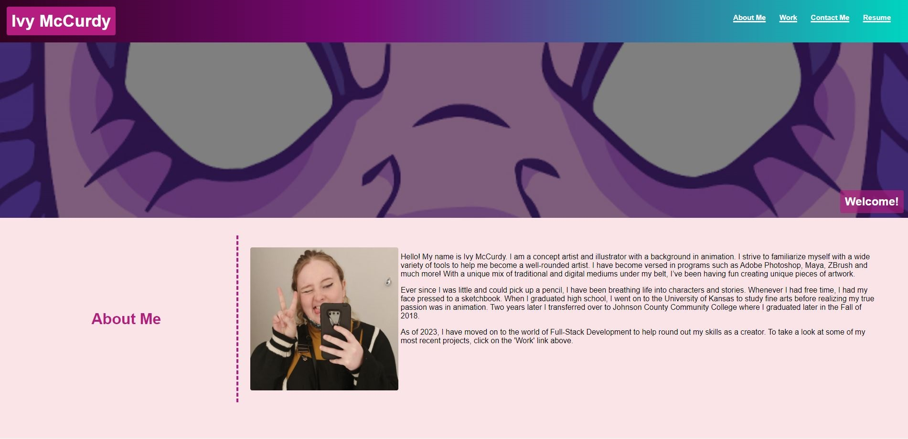

# Challenge 2

## Description
Now that I have some tools under my Full-Stack Developer belt, I can now use that to create my very first portfolio! This portfolio will section out into three main bodies of content-'About Me', 'Work', and 'Contact Me'. 

## Usage



The primary objective of this challenge will be to create interactive images and links that will better help guide future employers toward my work and my socials. 

<a href="https://ivysmac.github.io/challenge-2/">Live Site</a>


## User Story

```
AS AN employer
I WANT to view a potential employee's deployed portfolio of work samples
SO THAT I can review samples of their work and assess whether they're a good candidate for an open position

```
## Acceptance Criteria

```
GIVEN I need to sample a potential employee's previous work
WHEN I load their portfolio
THEN I am presented with the developer's name, a recent photo or avatar, and links to sections about them, their work, and how to contact them
WHEN I click one of the links in the navigation
THEN the UI scrolls to the corresponding section
WHEN I click on the link to the section about their work
THEN the UI scrolls to a section with titled images of the developer's applications
WHEN I am presented with the developer's first application
THEN that application's image should be larger in size than the others
WHEN I click on the images of the applications
THEN I am taken to that deployed application
WHEN I resize the page or view the site on various screens and devices
THEN I am presented with a responsive layout that adapts to my viewport

```

## Credits

### Code
<a href="https://www.w3schools.com/howto/default.asp">W3schools.com</a> - responsive header, image hover overlay, & hero image
<p>
<a href="https://www.cssgradient.io/">cssgradient.io</a> - gradient for header
<p>
<a href="https://www.youtube.com/watch?v=rnhoY5Cdmy0&t=648s&ab_channel=dcode">dcode</a> @Youtube - image grid

### Images

img-1 & img-3 - <a href="https://www.vecteezy.com/members/yganko">yganko on vecteezy</a> 

img-2, img-4, img-5 - <a href="https://www.vecteezy.com/members/emojoez">emojoez on vecteezy</a>

hero image was drawn by me 

